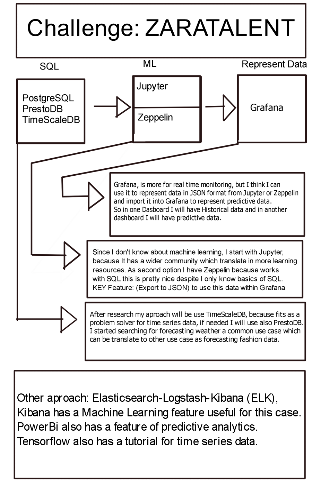

# zaratalent-architecture-tech
One possible: Architecture tech for zaratalent data challenge, 2019. Possible coordination of team or teams.

Why Do I publish this?
Document my research and results, implement if possible the solution in time.
Maybe find a team or set an environment for people to find a team.

You can raise an issue or search in existing issue if there is one to find a team.
Example title: "Coordinate Team (Name)"

I have the very basics of SQL, Anaconda/Jupyter and Grafana.

Enjoy!